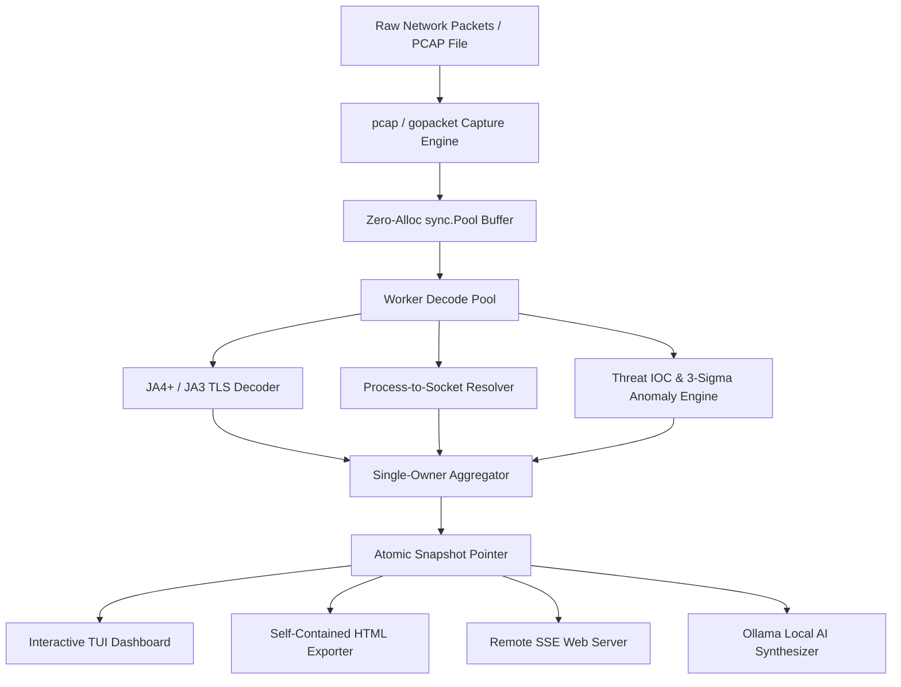

# Undertow — Terminal SOC Workstation & Go Packet Sniffer

[](https://golang.org)
[](https://github.com/Codexia-afk/Undertow)
[](https://opensource.org/licenses/MIT)
[](https://github.com/Codexia-afk/Undertow)
[](https://github.com/Codexia-afk/Undertow)
[](https://github.com/Codexia-afk/Undertow/pulls)

> **Zero-dependency, Ultra-Performance Terminal SOC Workstation & Packet Sniffer written in pure Go with JA4+ TLS Fingerprinting, Local Process-to-Socket Correlation, ASCII Topology Mapping, and Offline AI Incident Summarization.**

**Undertow** is a single-binary, high-throughput **Terminal SOC Workstation and Network Traffic Analyzer** built for security analysts, incident responders, network engineers, and system administrators. It captures live network frames, decodes deep protocol stacks (Ethernet, IPv4/IPv6, TCP, UDP, TLS, HTTP, DNS), computes **JA4+ and JA3 TLS fingerprints** without payload decryption, maps network sockets directly to operating system processes (PID, Executable Path, User), detects 3-sigma behavioral anomalies and threat IOCs, renders an interactive ASCII topology graph, synthesizes local offline AI incident summaries via Ollama, and exports multi-surface reports (TUI, standalone vector SVG HTML reports, and SSE remote streaming).

---

## 📌 Table of Contents
- [Why Undertow? (Wireshark & Termshark Alternative)](#-why-undertow-wireshark--termshark-alternative)
- [Key Features Breakdown](#-key-features-breakdown)
  - [1. Encrypted Traffic Inspection (JA4+ & JA3 Fingerprinting)](#1-encrypted-traffic-inspection-ja4--ja3-fingerprinting)
  - [2. Local Process-to-Socket Correlation](#2-local-process-to-socket-correlation-linux-macos-windows)
  - [3. ASCII Network Topology Graph View](#3-ascii-network-topology-graph-view)
  - [4. "Ask AI" Local Incident Response (Ollama Integration)](#4-ask-ai-local-incident-response-ollama-integration)
  - [5. Air-Gapped Threat Intelligence & Anomaly Engine](#5-air-gapped-threat-intelligence--anomaly-engine)
  - [6. Triple-Surface Reporting Engine](#6-triple-surface-reporting-engine)
  - [7. Session Snapshot Diffing](#7-session-snapshot-diffing-undertow-diff)
- [System Architecture](#-system-architecture)
- [Installation & Quick Start](#-installation--quick-start)
  - [Linux (Ubuntu, Debian, Kali, Arch, Fedora)](#linux-ubuntu-debian-kali-arch-linux-fedora-alpine-linux-mint)
  - [macOS (Apple Silicon & Intel)](#macos-apple-silicon-m1m2m3m4--intel)
  - [Windows (PowerShell & CMD)](#windows-powershell--command-prompt)
- [CLI Flag Reference](#-cli-flag-reference)
- [Interactive Keyboard Shortcuts](#-interactive-keyboard-shortcuts-cheat-sheet)
- [FAQ & Troubleshooting](#-faq--troubleshooting)
- [License](#-license)

---

## ⚡ Why Undertow? (Wireshark & Termshark Alternative)

Undertow is engineered from the ground up to replace bloated web analyzers and heavy packet capture background daemons with a zero-alloc, single-binary terminal workstation.

| Feature / Metric | **Undertow (v5.0.1)** | **Termshark** | **bandwhich** | **ntopng** | **Zeek** |
|:---|:---:|:---:|:---:|:---:|:---:|
| **Zero-Alloc Concurrency** | ✅ Yes (`sync.Pool`) | ❌ No | ❌ No | ❌ No | ❌ No |
| **JA4+ & JA3 Fingerprinting** | ✅ Built-in | ❌ No | ❌ No | ⚠️ Plugin | ✅ Script |
| **Process-to-Socket Correlation** | ✅ Linux/macOS/Win | ❌ No | ✅ Basic | ⚠️ Agent | ❌ No |
| **Air-Gapped Threat Intel (IOC)** | ✅ Spamhaus + Custom | ❌ No | ❌ No | ⚠️ Complex | ✅ Script |
| **ASCII Topology Graph View** | ✅ Live (`tview`) | ❌ No | ❌ No | ❌ No | ❌ No |
| **Local AI Incident Summary** | ✅ Local Ollama | ❌ No | ❌ No | ❌ No | ❌ No |
| **Triple-Surface Output** | ✅ TUI / HTML / SSE | ⚠️ TUI Only | ⚠️ TUI Only | ⚠️ Web Only | ⚠️ Log Only |
| **Single Portable Binary** | ✅ 100% Standalone | ⚠️ Requires tshark | ✅ Rust binary | ❌ Complex | ❌ Enterprise |

---

## 🚀 Key Features Breakdown

### 1. Encrypted Traffic Inspection (JA4+ & JA3 Fingerprinting)
Undertow inspects raw TLS ClientHello frames (`0x16 0x03`) without decrypting TLS payloads:
* **JA4+ Fingerprint Calculation**: Extracts protocol type (`t`), TLS version (`13`/`12`), SNI status (`d`/`i`), non-GREASE cipher count, extension count, ALPN characters (`h2`), and SHA256 truncated digests of sorted ciphers and extensions.
* **Malware Signature Lookup**: Matches generated hashes against an embedded offline lookup database (`ja4db.json`) to detect malware tools (**Cobalt Strike C2**, **LummaC2 Infostealer**, **Evilginx**, **IcedID**) and legitimate client engines (**Chrome**, **curl**, **Go net/http**).

### 2. Local Process-to-Socket Correlation (Linux, macOS, Windows)
Undertow maps active 5-tuple network flows (`SrcIP:SrcPort -> DstIP:DstPort`) directly to host operating system processes:
* **Linux**: Correlates socket inodes from `/proc/net/tcp` and `/proc/net/udp` to `/proc/[pid]/fd/*`, executable paths in `/proc/[pid]/exe`, and user owners from `/proc/[pid]/status`.
* **Windows**: Performs `netstat -ano` / `GetExtendedTcpTable` endpoint correlation.
* **macOS**: Resolves sockets via `lsof -i -n -P` inspection.
* **Process Matrix (`HotKey: P`)**: Displays a real-time TUI panel listing `[PID] [PROCESS NAME] [USER] [EXECUTABLE PATH]`.

### 3. ASCII Network Topology Graph View (`HotKey: g`)
Text-mode node-and-edge layout engine rendered via `tview` grouping local subnet endpoints versus remote servers, with edges styled by real-time bandwidth consumption (`────>`, `======>`, `<=====>`).

### 4. "Ask AI" Local Incident Response (Ollama Integration) (`HotKey: A`)
Connects to a local Ollama LLM instance (`http://localhost:11434`, model `llama3`/`mistral`) to transform host Flow Story Narratives and Anomaly Logs into plain-English incident response summaries. Includes an offline rule synthesizer when Ollama is unreachable.

### 5. Air-Gapped Threat Intelligence & Anomaly Engine
* **Threat IOC Engine**: Matches active traffic against embedded Spamhaus DROP CIDR blocks, exact malicious C2 IPs, and C2 domain indicators. Supports custom threat lists via `--threat-feed feeds.json`.
* **3-Sigma Adaptive Baselining**: Learns normal per-host traffic behavior using Exponential Moving Averages (EMA) and Welford running variance, persisting baseline profiles to `~/.undertow/baseline.json`.
* **Security Badging**: Marks suspicious flows in the packet stream with a bold **`[!] THREAT_ALERT`** badge.

### 6. Triple-Surface Reporting Engine
1. **Live Interactive TUI**: Terminal dashboard built with `tview` using lock-free `atomic.Pointer[Snapshot]` read paths.
2. **Self-Contained HTML Report**: Exports 100% offline HTML SOC reports (`--export report.html` or `e` key) containing inline vector SVG charts.
3. **Remote Web Streaming**: Broadcasts live metrics over Server-Sent Events (`--listen :8080` with `--serve-token`) to any browser.

### 7. Session Snapshot Diffing (`undertow diff`)
CLI subcommand `undertow diff captureA.json captureB.json [--output-md diff.md]` comparing session snapshots to highlight endpoint drift, host throughput deviations (>20%), and novel fingerprints.

---

## 🏗️ System Architecture



---

## 💻 Installation & Quick Start

### Linux (Ubuntu, Debian, Kali, Arch Linux, Fedora, Alpine, Linux Mint)

```bash
# Install prerequisites (Debian/Ubuntu/Kali/Mint)
sudo apt update && sudo apt install -y golang-go libpcap-dev build-essential git

# Clone and build Undertow
git clone https://github.com/Codexia-afk/Undertow.git
cd Undertow
go build -o undertow ./cmd/undertow

# Grant raw socket capabilities (no root required for execution) & run
sudo setcap cap_net_raw,cap_net_admin=eip ./undertow
./undertow -i eth0 -export report.html
```

### macOS (Apple Silicon M1/M2/M3/M4 & Intel)

```bash
# Install Homebrew dependencies
brew install libpcap go

# Clone and build Undertow
git clone https://github.com/Codexia-afk/Undertow.git
cd Undertow
go build -o undertow ./cmd/undertow

# Run with sudo (required for raw BPF capture on macOS)
sudo ./undertow -i en0 -export report.html
```

### Windows (PowerShell & Command Prompt)

```powershell
# 1. Download & Install Npcap (https://npcap.com)
#    Make sure to check "Install Npcap in WinPcap API-compatible Mode" during setup.

# 2. Clone and build Undertow in PowerShell (as Administrator)
git clone https://github.com/Codexia-afk/Undertow.git
cd Undertow
go build -o undertow.exe ./cmd/undertow

# 3. List available network interfaces on Windows
.\undertow.exe

# 4. Start live packet capture (specify interface device string, e.g. \Device\NPF_{...})
.\undertow.exe -i "\Device\NPF_{YOUR_ADAPTER_GUID}" -export report.html

# 5. Replay offline pcap or run session snapshot diff
.\undertow.exe -replay sample.pcap -listen :8080
.\undertow.exe diff snapA.json snapB.json --output-md diff.md
```

---

## ⚙️ CLI Flag Reference

| Flag | Default | Description |
|:---|:---:|:---|
| `-i` | `""` | Network interface for live capture (e.g. `eth0`, `en0`, `\Device\NPF_{...}`) |
| `-snaplen` | `65535` | Maximum bytes per captured packet |
| `-promisc` | `true` | Enable promiscuous capture mode |
| `-filter` | `""` | Initial BPF capture filter (e.g., `'port 80'`, `'tcp and host 10.0.0.5'`) |
| `-record` | `""` | Record live captured network packets to `.pcap` file |
| `-replay` | `""` | Replay recorded `.pcap` file with virtual clock DVR playback controls |
| `-export-html` / `-export` | `""` | Export session metrics to self-contained standalone HTML report on exit |
| `-serve` / `-listen` | `""` | Start remote HTTP SSE web monitoring server (e.g., `:8080`) |
| `-serve-token` | `""` | Secret authentication token for remote SSE web server |
| `-threat-feed` | `""` | Path to custom threat intelligence JSON feed |
| `-headless` / `-no-tui` | `false` | Run in headless daemon mode without TUI dashboard |
| `-webhook-url` | `""` | HTTP POST webhook URL for real-time JSON security alerts |
| `-workers` | `runtime.NumCPU()` | Number of parallel packet decoding worker goroutines |

---

## ⌨️ Interactive Keyboard Shortcuts Cheat Sheet

| Shortcut Key | Action / Feature View |
|:---:|:---|
| `g` / `G` | Toggle **ASCII Network Topology Graph** view |
| `P` | Open **Process Matrix** panel (PID, Process Name, User, Executable Path) |
| `A` / `a` | Trigger **Ask AI Local Incident Response** summary (Ollama) |
| `s` / `n` | View **Host Flow Story Narrative** for selected talker IP |
| `e` / `E` | Instantly export self-contained **HTML SOC Report** with vector SVGs |
| `/` | Open interactive **BPF Capture Filter** input modal |
| `p` | Pause / resume live packet stream auto-scrolling |
| `Space` | (Replay Mode) Pause / play virtual clock |
| `→` / `←` | (Replay Mode) Step 5 seconds forward / backward |
| `+` / `-` | (Replay Mode) Cycle virtual playback speed (`0.5x` → `8.0x`) |
| `Home` / `End` | (Replay Mode) Jump to start / end of recording |
| `q` / `Q` | Gracefully exit application |

---

## ❓ FAQ & Troubleshooting

### Q1: Why did `go build` show `stat .../cmd/undertow: directory not found`?
**Answer**: Make sure your `.gitignore` uses `/undertow` instead of `undertow`. An unanchored `undertow` rule ignores any folder named `undertow` including `cmd/undertow`. Pull the latest code (`git pull origin main`) where this is fixed.

### Q2: Why does `sudo ./undertow` say `command not found`?
**Answer**: Make sure to run `go build -o undertow ./cmd/undertow` inside the repository folder first to produce the compiled executable binary.

### Q3: How do I run Undertow without `sudo` on Linux?
**Answer**: Run `sudo setcap cap_net_raw,cap_net_admin=eip ./undertow`. This grants raw network packet capture privileges directly to the binary so any non-root user can execute it safely.

---

## 📄 License

Distributed under the [MIT License](LICENSE).
